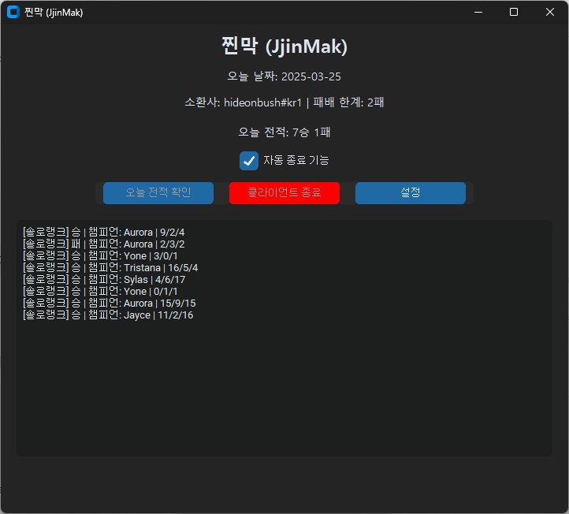
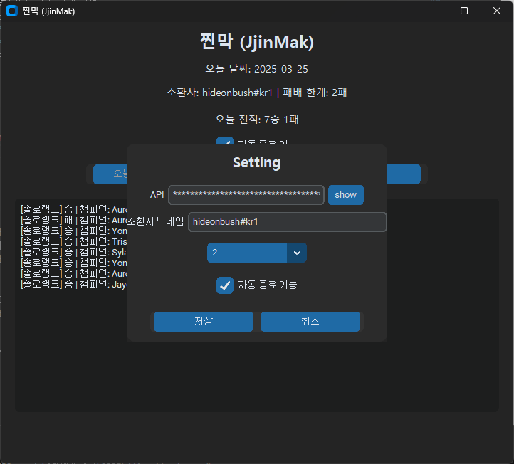

# ⏳ 찐막 (JjinMak) - 진짜 마지막 판

롤(LoL) 중독을 막기 위한 자율 제어 프로그램

## 📌 소개

**찐막(JjinMak)** 은 Riot API를 기반으로 오늘 하루의 전적을 실시간으로 모니터링하여,  
지정한 패배 한계(예: 2패)를 초과하면 자동으로 롤 클라이언트를 종료시켜주는 프로그램입니다.

더 이상 "이 판만 하고 끌게"라는 말로 자신을 속이지 마세요.  
**찐막이 당신의 의지를 지켜드립니다.**

---

## ✨ 주요 기능

- 🔐 **Riot API 연동**을 통한 전적 확인
- 📅 **오늘 날짜 기준** 전적만 필터링
- ⚙️ **사용자 설정 기능**
  - Riot ID 입력
  - API Key 설정
  - 패배 한계 설정 (1~5패)
  - 자동 종료 기능 On/Off
- 🔄 **자동 감시 모드**
  - 10분마다 자동 전적 확인
  - 조건 초과 시 롤 클라이언트 실시간 감지 후 즉시 종료
- 👀 **클라이언트 수동 종료 및 수동 확인** 버튼 제공
- 🔒 **API 키 마스킹 처리 및 show/hide 토글 버튼**
- 💾 설정값은 `config.json`에 자동 저장

---

## 🖥️ 실행 화면






---

## 🧩 설치 및 실행 방법

1. Python 3.11 이상 설치
2. 아래 라이브러리 설치
   ```bash
   pip install customtkinter requests psutil
   ```
3. 프로그램 실행
   ```bash
   run_Jjinmak.bat
   ```
4. 프로그램을 처음 실행하면 `config.json`이 자동 생성됩니다.

---

## ⚙️ 설정창 안내

- 프로그램 내 `설정` 버튼 클릭 시, 설정창이 메인 화면 안에서 팝업처럼 열립니다.
- 설정창에서 다음을 수정할 수 있습니다:
  - **API 키**: Riot 개발자 페이지에서 발급
  - **소환사 닉네임**: `닉네임#태그` 형식 (예: `HideOnBush#KR1`)
  - **패배 한계**: 1~5 선택
  - **자동 종료 기능**: 체크박스 on/off
- 저장 시 `config.json`에 반영되며, 프로그램이 자동으로 상태를 갱신합니다.

---

## ❗ 유의사항

- Riot API 키는 **24시간마다 만료**됩니다. 주기적으로 새 키를 입력해주세요.
- 소환사 닉네임 변경 시에도 설정창에서 업데이트가 필요합니다.
- API 오류 또는 닉네임 형식 오류가 발생하면 설정창이 자동으로 열립니다.
- 이 프로그램은 학습 및 자율 제어를 위한 도구이며, 강제적 차단 프로그램은 아닙니다.

---

## 🧠 아이디어 배경

> 게임을 끄겠다는 결심은 누구나 하지만, 그 결심을 지키는 건 쉽지 않습니다.  
> 찐막은 당신이 결심한 **진짜 마지막 판**을 지킬 수 있도록 돕습니다.

---

## 📄 라이선스

MIT License
